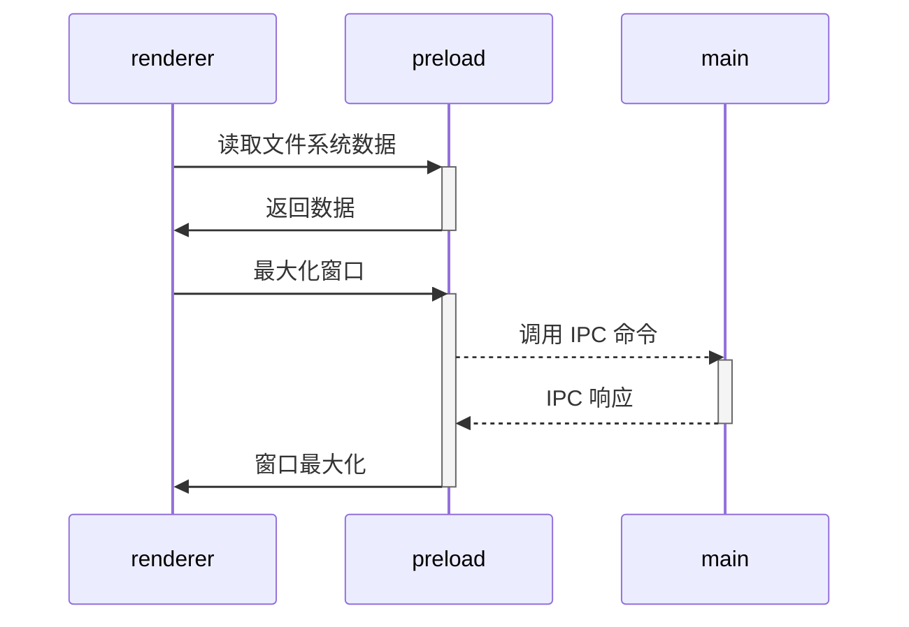

# 第一个 electron 应用

## 核心概念




1. main.js - （main）主进程

electron 的入口文件，负责管理应用的生命周期和创建窗口，同时负责与渲染进程通信。

2. index.html,index.js （render）渲染进程

渲染进程的入口文件，负责渲染界面和处理用户交互。

> 这里的 index.js 、 preload.js 和 main.js 是不同的上下文。

3. preload.js - preload 预加载脚本

预加载脚本在渲染器加载网页之前注入，类似于 Chrome 扩展的内容脚本 。若要在渲染器中添加需要特权访问的功能，可以通过定义全局对象来实现 contextBridge API


> **预加载脚本沙盒化**
>
>从 Electron 20 版本开始，预加载脚本默认被沙盒化 ，不再能够访问完整的 Node.js 环境。实际上这意味着你有一个被 polyfilled 的 require 一个只能访问有限 API 集的函数。
>
> |可用 API|描述|
> |---|---|
> |Electron 模块|渲染进程模块|
> |Node.js 模块|events, timers, url|
> |填充的全局变量|Buffer, process, clearImmediate, setImmediate|
>
> 更多信息，请查看进程 [沙箱指南](https://www.electronjs.org/docs/latest/tutorial/sandbox)。


3. package.json - 配置文件

electron 的配置文件，负责配置应用的名称、版本、描述等信息。需要在 main 字段指定入口文件。

## 打包配置说明

```json
{
  "name": "my-electron-app",
  "version": "1.0.0",
  "main": "main.js",
  "scripts": {
    // 基础打包（根据当前系统自动打包对应平台）
    "build": "electron-builder",
    // 仅打包未压缩的目录（测试用，速度快）
    "pack": "electron-builder --dir",
    // Windows 打包（可指定安装包类型）
    "build:win": "electron-builder --win",
    // macOS 打包
    "build:mac": "electron-builder --mac",
    // Linux 打包
    "build:linux": "electron-builder --linux",
    // 全平台打包（需对应系统环境/跨平台配置）
    "build:all": "electron-builder --win --mac --linux",
    // 打包并跳过代码签名（开发测试用）
    "build:unsigned": "electron-builder --win --config.artifactName=${productName}-${version}-${arch}.${ext} --publish never",
    // 打包后自动发布（如 GitHub Releases）
    "build:publish": "electron-builder --publish always"
  },
  "build": {
    "appId": "com.my-electron-app.app", // 唯一标识（反向域名格式）
    "productName": "我的Electron应用", // 应用名称
    "directories": {
      "output": "dist" // 打包输出目录
    },
    "files": [ // 需打包的文件（默认包含根目录，可排除）
      "dist/**/*",
      "src/**/*",
      "main.js",
      "package.json"
    ],
    "mac": { // macOS 配置
      "target": ["dmg", "zip"], // 输出格式：dmg（安装包）+ zip（免安装）
      "icon": "assets/icon.icns" // 应用图标
    },
    "win": { // Windows 配置
      "target": ["nsis", "portable"], // nsis（安装包）+ portable（免安装）
      "icon": "assets/icon.ico"
    },
    "linux": { // Linux 配置
      "target": ["deb", "AppImage"],
      "icon": "assets/icon.png"
    }
  }
}
```

关键配置说明：
- files：指定需要打包的文件，支持 ! 排除（如 "!node_modules/**/*.md"）；
- asar：默认 true，将代码打包为 asar 文件（防止源码暴露）；
- publish：配置自动更新源（如 GitHub Releases、私有服务器）。

## 参考文档

- [Electron 官方文档](https://www.electronjs.org/zh/docs/latest/)
- [Electron Builder 官方文档](https://www.electron.build/)
